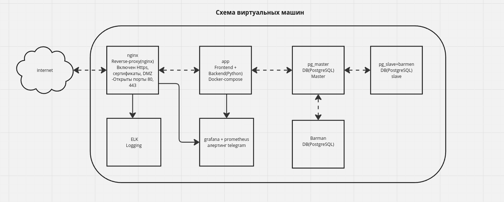

# Задание

## Цель:
- Закрепить и продемонстрировать полученные знания и навыки;
- Создать веб-проект;
- Подготовить портфолио для работодателя.

## Описание/Пошаговая инструкция выполнения домашнего задания:
### Создание рабочего проекта

Веб-проект с развертыванием нескольких виртуальных машин должен отвечать следующим требованиям:

- включен https;
- основная инфраструктура в DMZ зоне;
- файрвалл на входе;
- сбор метрик и настроенный алертинг;
- везде включен selinux 
- организован централизованный сбор логов - ELK;
- организован backup - Barman.

### Описание проекта

#### Компоненты системы:
- **Nginx**: Reverse-proxy сервер, обрабатывающий HTTPS запросы.
- **App**: Приложение, состоящее из Frontend и Backend, развернутое с использованием Docker Compose.
- **PostgreSQL Master**: Главная база данных PostgreSQL.
- **PostgreSQL Slave**: Реплика базы данных PostgreSQL.
- **Barman**: Система резервного копирования для PostgreSQL.
- **Prometheus и Grafana**: Система мониторинга и алертинга.
- **ELK**: Система логирования и анализа логов.

### Как запустить проект

1. Установите Vagrant и VirtualBox.
2. Склонируйте репозиторий проекта.
3. Запустите `vagrant up` в корневом каталоге проекта.

### Ссылки проекта:

- **Frontend**: [https://otus.project.local](https://otus.project.local)
- **ELK (Kibana)**: [http://192.168.56.16:5601](http://192.168.56.14:5601)
- **Grafana**: [http://192.168.56.17:3000/?orgId=1](http://192.168.56.17:3000/?orgId=1)
- **Miro**: [https://miro.com/app/board/uXjVKFt4Goc=/](https://miro.com/app/board/uXjVKFt4Goc=/)

### Схема ВМ проекта:   

